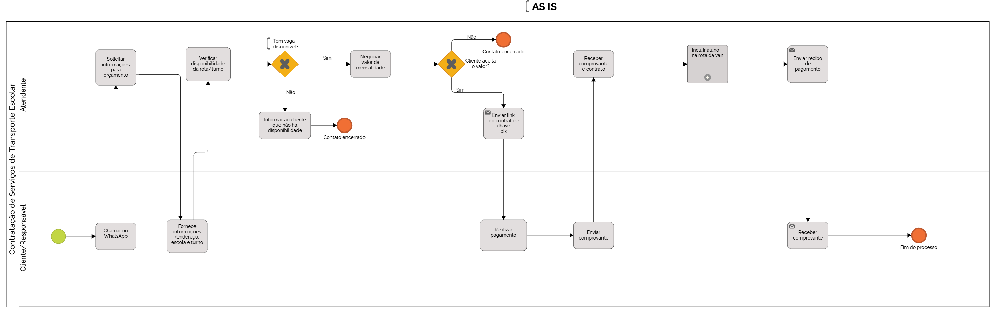
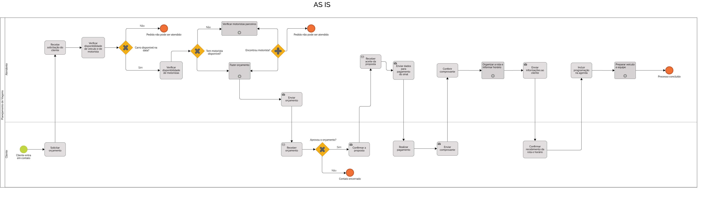

# Modelagem dos processos de negócio

Pré-requisitos: <a href="02-Especificacao.md"> Especificação do projeto</a>

## Modelagem da situação atual (Modelagem AS IS)

  Atualmente, a Transol, ainda utiliza processos manuais e sistemas desconectados para gerenciar suas operações diárias. A comunicação entre os administradores, motoristas e responsáveis pelos alunos é feita por mensagens enviadas por WhatsApp e registros em planilhas eletrônicas ou até mesmo em cadernos físicos. Essa forma de operação gera diversos problemas para a empresa. A ausência de um controle centralizado dificulta o gerenciamento eficiente das informações dos clientes, dos pagamentos realizados e das rotas diárias. Além disso, o acompanhamento da manutenção dos veículos e da quilometragem atualizada é feito de forma esporádica, o que compromete a confiabilidade dos dados e a segurança da frota.
Outro ponto crítico é a inexistência de um registro histórico organizado, o que dificulta a realização de auditorias internas ou qualquer tipo de análise gerencial. A comunicação com os pais e responsáveis pelos alunos também sofre com atrasos e falhas, o que pode comprometer a confiança no serviço prestado. O processo de pagamento, por sua vez, não é automatizado: os responsáveis precisam enviar os comprovantes por WhatsApp, e a conferência é feita manualmente pelos administradores, aumentando o risco de erros e de perda de informações. Além disso, o cadastro de motoristas e veículos ainda é feito de forma manual, sem integração com bancos de dados oficiais ou sistemas públicos, o que exige verificações adicionais e aumenta a burocracia no dia a dia da empresa.
O processo de planejamento de viagem na Transol é realizado de forma manual e envolve diversas etapas que demandam tempo e atenção por parte dos administradores. Inicialmente, é necessário verificar a disponibilidade de motoristas e veículos, o que é feito por meio de consultas informais, geralmente via mensagens ou ligações. Em seguida, as rotas são elaboradas  utilizando ferramentas como Google Maps de forma independente, sem integração com um sistema central. As rotas planejadas são então registradas em planilhas ou cadernos, e comunicadas aos motoristas por meio de aplicativos de mensagens, o que pode gerar atrasos e inconsistências. Caso haja qualquer alteração, problema com um veículo, todo o processo precisa ser refeito manualmente, o que aumenta o risco de falhas e retrabalho.
resuma esse texto para a metade, porem sem perder muito conteudo.

## Contratação de transporte escolar-ASIS
 

## Planejamento de Viagens-ASIS

## Descrição geral da proposta (Modelagem TO BE)

### Contratação de Serviços de Transporte Escolar

Depois de analisar o processo atual (AS-IS), foi possível ver que ele é muito manual, depende de várias conversas no WhatsApp e tem etapas repetitivas. Tudo isso deixa o atendimento mais demorado e confuso.
A proposta do novo processo (TO-BE) é deixar tudo mais rápido e organizado usando a tecnologia. O cliente continua entrando em contato pelo WhatsApp, mas já recebe um link com um formulário para preencher os dados. A partir daí, o sistema cuida de tudo: verifica se tem vaga, calcula o valor da mensalidade, gera o contrato e envia a chave PIX para o pagamento. Depois que o cliente paga, o sistema confirma e avisa que o aluno foi incluído na rota da van.
O atendente só entra se for necessário, como em casos de dúvidas ou se o pagamento não for identificado automaticamente. Isso ajuda a equipe a ganhar tempo e focar em outras tarefas importantes.

#### Oportunidades de melhoria

- Atendimento mais rápido e com menos esforço.
- Menos erros e mais organização nas informações.
- Processo padronizado, sem vai-e-volta.
- Atendente disponível para casos mais importantes.
- Melhor experiência para o cliente.

#### Limites da solução

- Se o pagamento não for identificado automaticamente, o atendente precisa verificar.
- É necessário ter um sistema e internet para usar o formulário e as automações.
- Algumas pessoas podem ter dificuldade com tecnologia.

#### Alinhamento com os objetivos do negócio

Esse novo processo ajuda o serviço de transporte escolar a crescer, atendendo mais pessoas com mais agilidade e organização. Também melhora a comunicação e a experiência de quem contrata.

## Modelagem dos processos

[PROCESSO 1 - Contratação de transporte escolar](./processes/processo-1-CONTRATAÇÃO-DE-TRANSPORTE-ESCOLAR.md "Detalhamento do processo 1.")

[PROCESSO 2 - Planejamento de viagens](./processes/docs/processes/processo-2-PLANEJAMENTO-DE-VIAGENS.md "Detalhamento do processo 2.")

## Indicadores de desempenho

Apresente aqui os principais indicadores de desempenho e algumas metas para o processo. Atenção: as informações necessárias para gerar os indicadores devem estar contempladas no diagrama de classe. Coloque no mínimo 5 indicadores.

Use o seguinte modelo:

| **Indicador** | **Objetivos** | **Descrição** | **Fonte de dados** | **Fórmula de cálculo** |
| ---           | ---           | ---           | ---             | ---             |
| Percentual de reclamações | Avaliar quantitativamente as reclamações | Percentual de reclamações em relação ao total de atendimentos | Tabela Reclamações | número total de reclamações / número total de atendimentos |
| Taxa de requisições atendidas | Melhorar a prestação de serviços medindo a porcentagem de requisições atendidas| Mede a % de requisições atendidas na semana | Tabela Solicitações | (número de requisições atendidas / número total de requisições) * 100 |
| Taxa de entrega de material | Manter controle sobre os materiais que estão sendo entregues | Mede % de material entregue dentro do mês | Tabela Pedidos | (número de pedidos entregues / número total de pedidos) * 100 |

Obs.: todas as informações necessárias para gerar os indicadores devem estar no diagrama de classe a ser apresentado posteriormente.
