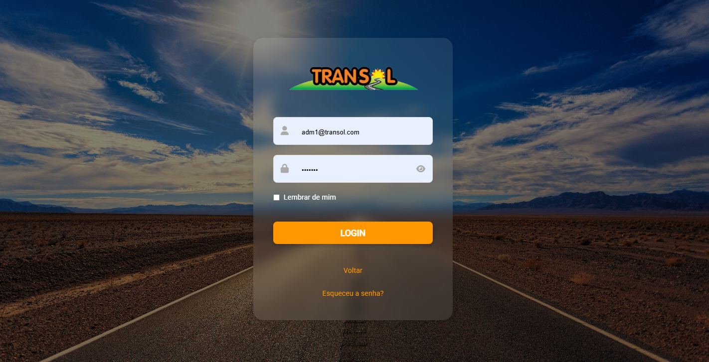

# Projeto de interface

Pré-requisitos: <a href="02-Especificacao.md"> Especificação do projeto</a>

 ## User flow

O fluxo do usuário se divide em três, a partir de tipos de logins diferentes. São eles o administrador do sistema, o cliente e o motorista, Cada um com suas telas e permissões pertinentes ao seu uso.

### Diagrama de fluxo
Este diagrama de fluxo representa o funcionamento do sistema da Transol, mostrando os caminhos que os diferentes perfis de usuários percorrem. Ele começa na tela de login, que direciona para três perfis: Cliente, Motorista e Administrador.

- O Cliente pode visualizar e atualizar dados, enviar comprovantes de pagamento e preencher formulários.
- O Motorista acessa suas rotas, visualiza veículos, adiciona quilometragem e registros de manutenção.
- O Administrador gerencia cadastros de clientes e motoristas, edita dados, cria rotas e atribui veículos.

Todos os fluxos convergem para o encerramento dos processos, representando a conclusão das atividades no sistema.

## Link para o protótipo interativo 

Segue o protótipo interativo feito no Figma

> - [protótipo interativo Transol](https://www.figma.com/proto/xlIznOchEOCRdWxV29P7ub/Transol?page-id=0%3A1&node-id=123-84&p=f&viewport=413%2C1042%2C0.25&t=ewmA8ZE3FgucOyes-1&scaling=scale-down&content-scaling=fixed&starting-point-node-id=1%3A2)
>

## Wireframes

### Home Page

### Login

### Contato

### ADM - Main Page

### ADM - Busca

### ADM - Editar Cliente

### ADM - Editar Motorista

### ADM - Editar Veículo

### ADM - Criar Rota

### Cliente/ADM - Perfil

### Cliente - Adicionar Comprovante

### Motorista/ADM - Main Page

### Motorista/ADM - Visualizar Rota

### Motorista/ADM - Dados do Veículo

## Interface do sistema

Visão geral da interação do usuário por meio das telas do sistema. Apresente as principais interfaces da plataforma em sua versão final.

### Tela principal do sistema

Descrição da tela principal do sistema.

> Insira aqui a tela principal do sistema

###  Telas do processo 1

Descrição da tela relativa à atividade 1 do processo 1.

> Insira aqui a tela da atividade 1

Descrição da tela relativa à atividade 2 do processo 1.

> Insira aqui a tela da atividade 2

### Telas do processo 2

Descrição da tela relativa à atividade 1 do processo 2.

> Insira aqui a tela da atividade 1

Descrição da tela relativa à atividade 2 do processo 2.

> Insira aqui a tela da atividade 2
