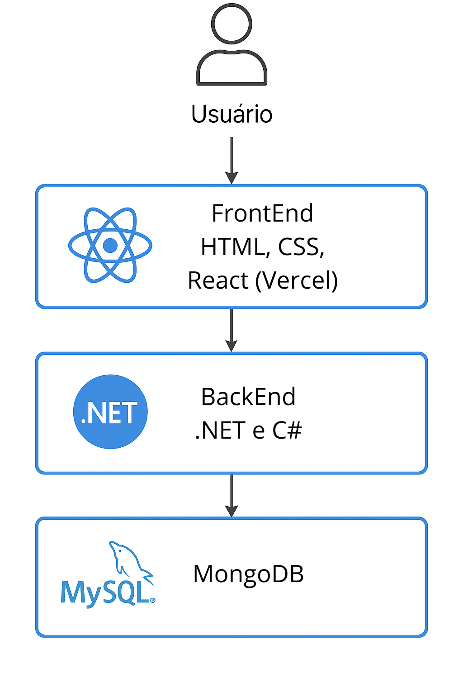
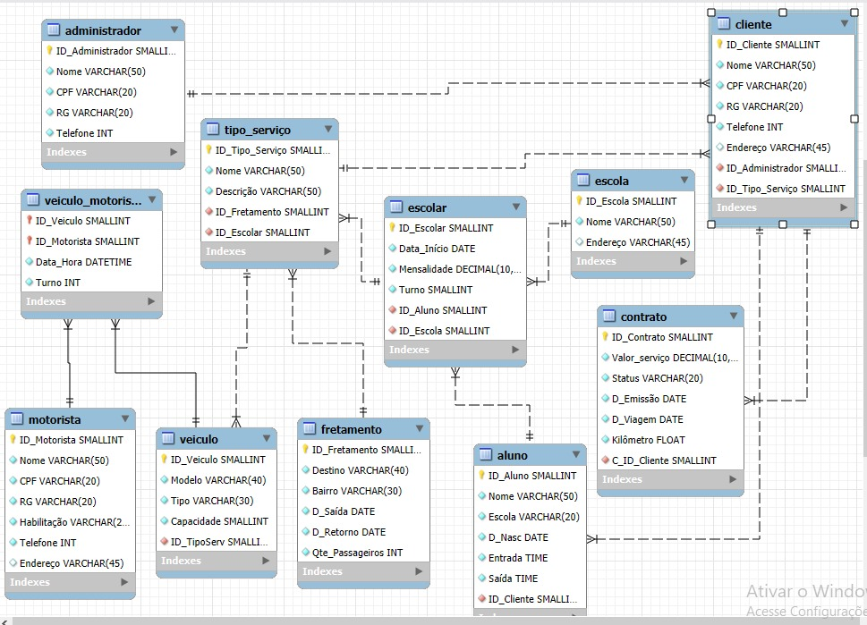

# Arquitetura da solução

A plataforma será composta por uma aplicação web com frontend e backend separados. A arquitetura utiliza o modelo **cliente-servidor** e será acessada diretamente pelo navegador.

- O **frontend** será desenvolvido com **React**, utilizando **HTML**, **CSS** e **JavaScript**, e ficará hospedado na **Vercel**.
- O **backend** será implementado com **C# e .NET**, responsável por processar as regras de negócio do sistema, como cadastro de alunos, rotas, motoristas, veículos e agendamentos.
- O banco de dados utilizado será o **MySQL**, armazenando as informações essenciais da aplicação.
- As IDEs utilizadas no projeto serão o **Visual Studio Code** (frontend) e o **Visual Studio** (backend).

### Funcionalidades principais

- Cadastro e autenticação de usuários (pais/responsáveis, motoristas, administradores);
- Gestão de rotas, veículos, horários e agendamentos;
- Histórico de transporte por aluno;
- Integração com métodos de pagamento.
<div align="center">
    
</div>

## Diagrama de classes

O diagrama de classes ilustra graficamente a estrutura do software e como cada uma das classes estará interligada. Essas classes servem de modelo para materializar os objetos que serão executados na memória.

> **Links úteis**:
> - [Diagramas de classes - documentação da IBM](https://www.ibm.com/docs/pt-br/rational-soft-arch/9.7.0?topic=diagrams-class)
> - [O que é um diagrama de classe UML?](https://www.lucidchart.com/pages/pt/o-que-e-diagrama-de-classe-uml)

##  Modelo de dados

O desenvolvimento da solução proposta requer a existência de bases de dados que permitam realizar o cadastro de dados e os controles associados aos processos identificados, assim como suas recuperações.

Utilizando a notação do DER (Diagrama Entidade-Relacionamento), elabore um modelo, usando alguma ferramenta, que contemple todas as entidades e atributos associados às atividades dos processos identificados. Deve ser gerado um único DER que suporte todos os processos escolhidos, visando, assim, uma base de dados integrada. O modelo deve contemplar também o controle de acesso dos usuários (partes interessadas nos processos) de acordo com os papéis definidos nos modelos do processo de negócio.

Apresente o modelo de dados por meio de um modelo relacional que contemple todos os conceitos e atributos apresentados na modelagem dos processos.

### Modelo ER


### Esquema relacional



### Modelo físico

Insira aqui o script de criação das tabelas do banco de dados.

Veja um exemplo:

```sql
-- Criação da tabela Medico
CREATE TABLE Medico (
    MedCodigo INTEGER PRIMARY KEY,
    MedNome VARCHAR(100)
);

-- Criação da tabela Paciente
CREATE TABLE Paciente (
    PacCodigo INTEGER PRIMARY KEY,
    PacNome VARCHAR(100)
);

-- Criação da tabela Consulta
CREATE TABLE Consulta (
    ConCodigo INTEGER PRIMARY KEY,
    MedCodigo INTEGER,
    PacCodigo INTEGER,
    Data DATE,
    FOREIGN KEY (MedCodigo) REFERENCES Medico(MedCodigo),
    FOREIGN KEY (PacCodigo) REFERENCES Paciente(PacCodigo)
);

-- Criação da tabela Medicamento
CREATE TABLE Medicamento (
    MdcCodigo INTEGER PRIMARY KEY,
    MdcNome VARCHAR(100)
);

-- Criação da tabela Prescricao
CREATE TABLE Prescricao (
    ConCodigo INTEGER,
    MdcCodigo INTEGER,
    Posologia VARCHAR(200),
    PRIMARY KEY (ConCodigo, MdcCodigo),
    FOREIGN KEY (ConCodigo) REFERENCES Consulta(ConCodigo),
    FOREIGN KEY (MdcCodigo) REFERENCES Medicamento(MdcCodigo)
);
```
Esse script deverá ser incluído em um arquivo .sql na pasta [de scripts SQL](../src/db).


## Tecnologias

| **Dimensão**    | **Tecnologia**                          |
|-----------------|------------------------------------------|
| Front-end       | HTML, CSS, JavaScript, React             |
| Back-end        | C#, .NET                                 |
| SGBD            | MySQL                                    |
| IDEs            | Visual Studio Code, Visual Studio        |
| Deploy          | Vercel                                   |


## Hospedagem

A aplicação está totalmente hospedada na Vercel, incluindo tanto o frontend (desenvolvido com HTML, CSS, JavaScript e React) quanto o backend (desenvolvido com .NET e C#).

A Vercel permite deploy contínuo diretamente do repositório no GitHub, facilitando o desenvolvimento, atualização e publicação do sistema de forma rápida e confiável.

O banco de dados utilizado é o MongoDB, hospedado na nuvem através do MongoDB Atlas, garantindo alta disponibilidade, escalabilidade e segurança para o armazenamento das informações do sistema.

## Qualidade de software

## Qualidade de Software

No desenvolvimento do sistema de transporte escolar e fretamento, foram priorizados os seguintes pontos de qualidade:

- **Manutenção fácil:**  
  O sistema será feito de forma organizada, com o código separado por partes. Isso ajuda na hora de corrigir erros, adicionar novas funções ou mudar algo no futuro sem quebrar o resto.

- **Boa usabilidade:**  
  A ideia é que qualquer pessoa consiga usar o sistema sem precisar de ajuda. Tudo será claro, direto e funcional — tanto em computador quanto no celular.

- **Segurança dos dados:**  
  Como o sistema lida com informações pessoais (alunos, pais, motoristas), tudo será tratado com cuidado. As informações ficarão protegidas contra acessos indevidos.

- **Funcionamento estável:**  
  O sistema precisa estar sempre disponível, principalmente nos horários de entrada e saída da escola. A estabilidade vai garantir que ninguém fique sem acesso quando mais precisa.

- **Acesso em qualquer lugar:**  
  O sistema será compatível com diferentes dispositivos e navegadores. Assim, o usuário consegue acessar de onde estiver, com praticidade e sem travamentos.

