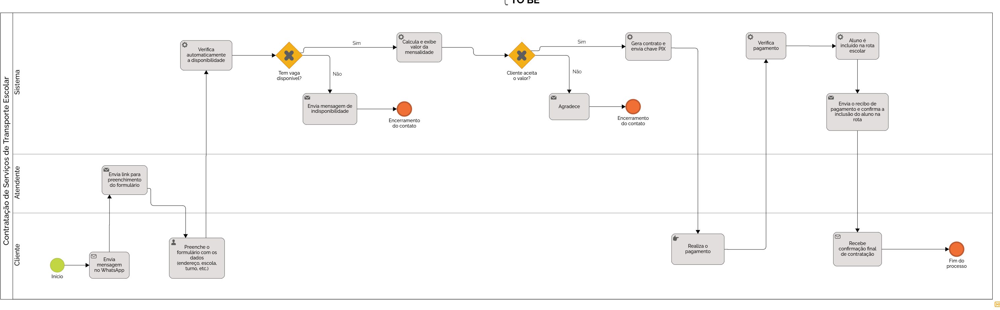

### 3.3.1 Processo 1 – CONTRATAÇÃO DE TRANSPORTE ESCOLAR
Depois de analisar o processo atual (AS-IS), foi possível ver que ele é muito manual, depende de várias conversas no WhatsApp e tem etapas repetitivas. Tudo isso deixa o atendimento mais demorado e confuso. A proposta do novo processo (TO-BE) é deixar tudo mais rápido e organizado usando a tecnologia. O cliente continua entrando em contato pelo WhatsApp, mas já recebe um link com um formulário para preencher os dados. A partir daí, o sistema cuida de tudo: verifica se tem vaga, calcula o valor da mensalidade, gera o contrato e envia a chave PIX para o pagamento. Depois que o cliente paga, o sistema confirma e avisa que o aluno foi incluído na rota da van. O atendente só entra se for necessário, como em casos de dúvidas ou se o pagamento não for identificado automaticamente. Isso ajuda a equipe a ganhar tempo e focar em outras tarefas importantes.

### Oportunidades de melhoria
•	Atendimento mais rápido e com menos esforço.
•	Menos erros e mais organização nas informações.
•	Processo padronizado, sem vai-e-volta.
•	Atendente disponível para casos mais importantes.
•	Melhor experiência para o cliente.
### Limites da solução
•	Se o pagamento não for identificado automaticamente, o atendente precisa verificar.
•	É necessário ter um sistema e internet para usar o formulário e as automações.
•	Algumas pessoas podem ter dificuldade com tecnologia.

### Alinhamento com os objetivos do negócio
Esse novo processo ajuda o serviço de transporte escolar a crescer, atendendo mais pessoas com mais agilidade e organização. Também melhora a comunicação e a experiência de quem contrata.

 

#### Detalhamento das atividades

_Descreva aqui cada uma das propriedades das atividades do processo 1. 
Devem estar relacionadas com o modelo de processo apresentado anteriormente._

_Os tipos de dados a serem utilizados são:_

_* **Área de texto** - campo texto de múltiplas linhas_

_* **Caixa de texto** - campo texto de uma linha_

_* **Número** - campo numérico_

_* **Data** - campo do tipo data (dd-mm-aaaa)_

_* **Hora** - campo do tipo hora (hh:mm:ss)_

_* **Data e Hora** - campo do tipo data e hora (dd-mm-aaaa, hh:mm:ss)_

_* **Imagem** - campo contendo uma imagem_

_* **Seleção única** - campo com várias opções de valores que são mutuamente exclusivas (tradicional radio button ou combobox)_

_* **Seleção múltipla** - campo com várias opções que podem ser selecionadas mutuamente (tradicional checkbox ou listbox)_

_* **Arquivo** - campo de upload de documento_

_* **Link** - campo que armazena uma URL_

_* **Tabela** - campo formado por uma matriz de valores_

**Nome da atividade 1**

| **Campo**       | **Tipo**         | **Restrições** | **Valor default** |
| ---             | ---              | ---            | ---               |
| [Nome do campo] | [tipo de dados]  |                |                   |
| ***Exemplo:***  |                  |                |                   |
| login           | Caixa de Texto   | formato de e-mail |                |
| senha           | Caixa de Texto   | mínimo de 8 caracteres |           |

| **Comandos**         |  **Destino**                   | **Tipo** |
| ---                  | ---                            | ---               |
| [Nome do botão/link] | Atividade/processo de destino  | (default/cancel/  ) |
| ***Exemplo:***       |                                |                   |
| entrar               | Fim do Processo 1              | default           |
| cadastrar            | Início do proceso de cadastro  |                   |

**Nome da atividade 2**

| **Campo**       | **Tipo**         | **Restrições** | **Valor default** |
| ---             | ---              | ---            | ---               |
| [Nome do campo] | [tipo de dados]  |                |                   |
|                 |                  |                |                   |

| **Comandos**         |  **Destino**                   | **Tipo**          |
| ---                  | ---                            | ---               |
| [Nome do botão/link] | Atividade/processo de destino  | (default/cancel/  ) |
|                      |                                |                   |
